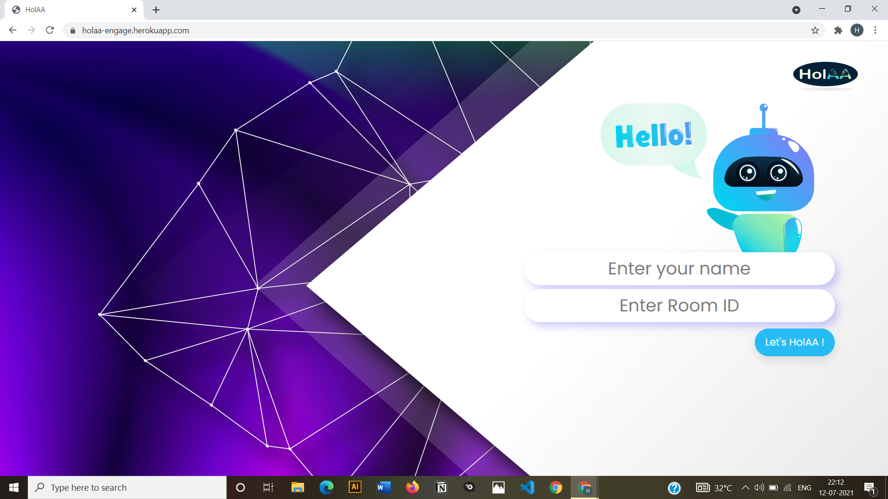

# HolAA

HolAA is an interactive video conferencing app inspired from MS Teams.

This app is build using NodeJS,Express,EJS, Socket.IO, and PeerJS(WebRTC)

### For checking out live Demo visit: https://holaa-engage.herokuapp.com/

1. You will see a landing page (as shown below) where you need to enter your `Name` and `Room ID`(if you have an exisiting one or you can create a new custom Room ID or else it will automatically generate a random Room ID using UUID package).
            
2. After entering in the room you can invite other participants by clicking on the invite button and send the joining info to the user.
3.  The other user can enter the link in the `Room ID` and after entering their name, the user would be connected.
4.  Now you can easily video call and even chat with the users.

### How to run the project on your local system?

1. Clone this repository in your local system.
    * Go to the directory where you want to clone this project.
    * Open your command prompt from your directory.
    * Type in `git clone https://github.com/holmes27/HolAA.git` (make sure you have git installed).
2. Open the command prompt from your project directory and run the command `npm install` to install the required node packages.
3. Now in the same command prompt window run the command `npm start`.
4. You will see `[nodemon] starting 'node server.js'` in the command prompt window, this means you have setup the server successfully in your system.
5. Now, go to your browser and type `http://127.0.0.1:2722/` in the address bar.
6. You will see a page where you need to enter your `Name` and `Room ID`(if you have an exisiting one or you can create a new custom Room ID or else it will automatically generate a random Room ID).
7. You will enter the room now.
